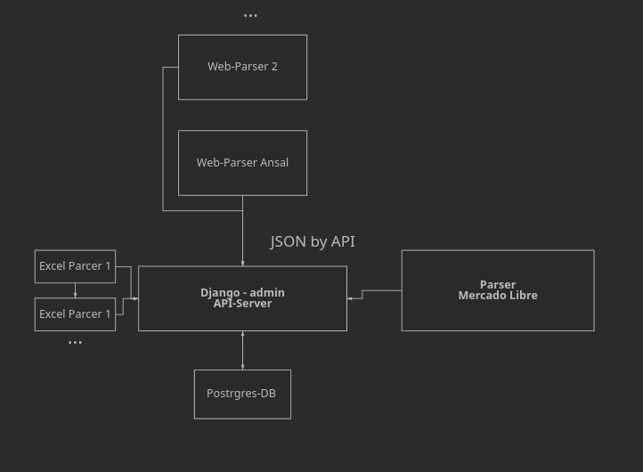

# Техническое задание: Разработка модулей парсинга цен

**Цель проекта:** Автоматизация сбора оптовых цен поставщиков и мониторинг розничных цен конкурентов.

---

## 1. Парсинг оптовых цен поставщиков

Необходимо реализовать сбор данных из прайс-листов и сайтов клиентов.

### Структура выходных данных
Данные должны быть организованы следующим образом:

**Строки:**
1. **Номенклатура**
2. **Категория** (на основании вложенного файла с номенклатурой и категориями).

**Столбцы:**
1. **Цена**
2. **Название магазина**
   * *Примечание:* В названии магазина необходимо указать процент скидки и размер НДС, либо реализовать автоматический пересчет цены с учетом этих параметров.

### Источники данных
Данные берутся с сайтов клиентов, а также из предоставленных реестров поставщиков:
* [Реестр поставщиков №1](https://docs.google.com/spreadsheets/d/1yKkmdWJuYjGst8ZD_IgEoRrs7cydejM1/edit?usp=sharing&ouid=100643320624399975536&rtpof=true&sd=true)
* [Реестр поставщиков №2](https://docs.google.com/spreadsheets/d/1gFxrBt3R9D8TLJc9amRcJkkQW-JZHOAv/edit?usp=sharing&ouid=117209478210493982427&rtpof=true&sd=true)
* Дополнительные поставщики, переданные Михаилом.

---

## 2. Парсинг розничных цен конкурентов

Необходимо реализовать мониторинг розничных площадок конкурентов для анализа рыночной ситуации.

### Образец заполнения
* [Файл-образец](https://docs.google.com/spreadsheets/d/1gFxrBt3R9D8TLJc9amRcJkkQW-JZHOAv/edit?usp=sharing&ouid=117209478210493982427&rtpof=true&sd=true)

### Список конкурентов (источники):
Данные собираются со следующих сайтов:
* **Ansal**
* **Reld**
* **Favale**
* **Norfrig**


## Стек технологий

Проект реализован с использованием современного стека инструментов для автоматизации сбора и обработки данных:

* **Python 3.11+** — основной язык разработки бизнес-логики и скриптов парсинга.
* **Django** — серверная часть для отображения данных и упрощенной работы с ними с помощью Django ORM. Данные с парсеров предполагается отправлять по АPI как json.
* **Docker** — контейнеризация приложения для обеспечения идентичности среды разработки и продакшена.
* **PostgreSQL** — реляционная база данных для хранения номенклатуры, истории цен и сопоставлений (mapping).
* **Playwright** — фреймворк для автоматизации браузера (используется для парсинга динамических сайтов с тяжелым JS).
* **BeautifulSoup4** — библиотека для быстрого извлечения данных из статического HTML-кода.
* **Pandas** — основной инструмент для анализа, очистки и трансформации данных из Excel и CSV прайс-листов.
* **Mercado Libre API** — прямая интеграция с маркетплейсом для получения актуальных рыночных цен в реальном времени.


### Примерная структура проекта



```
.
├── docker-compose.yaml
├── Dockerfile
├── documentation
│   ├── all_prods.xlsx
│   └── Копия Сравнительные цены -оптовые vs розница.xlsx
├── main_module


├── parsers
│   ├── ansal
│   ├── bellini
│   ├── favale
│   ├── fluorgaz
│   ├── mercado_libre
│   ├── nueva_hera
│   │   ├── main.py
│   │   ├── price_lists
│   │   ├── __pycache__
│   │   └── requirements.txt
│   ├── reld
│   │   ├── main.py
│   │   ├── __pycache__
│   │   ├── reld.xlsx
│   │   └── requirements.txt
│   ├── torrington
│   └── uriarte
│       ├── main.py
│       ├── __pycache__
│       ├── requirements.txt
│       └── uriarte.xlsx
├── README.md
├── requirements.txt
└── settings.py    

```